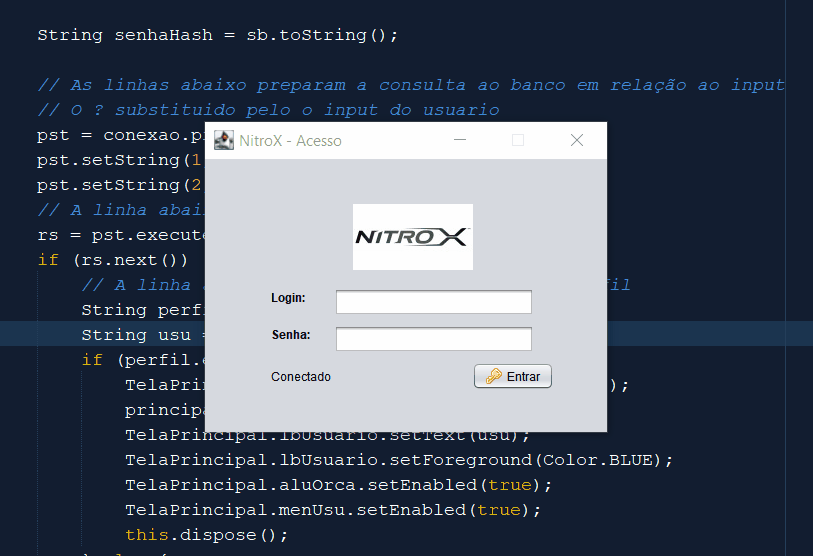
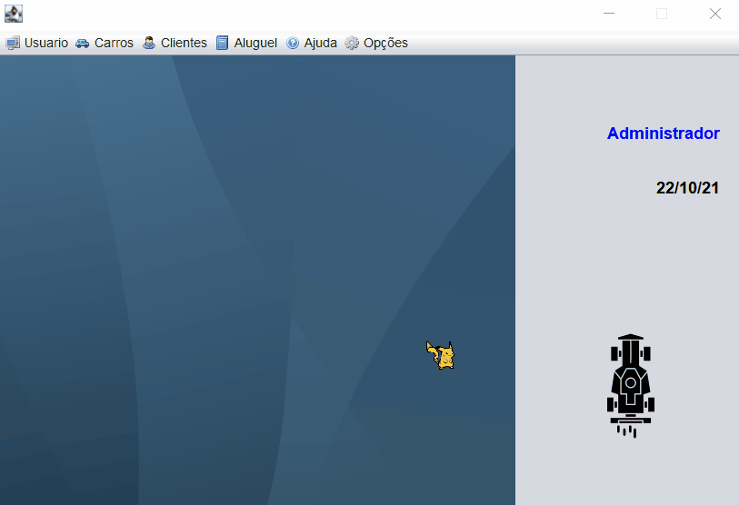
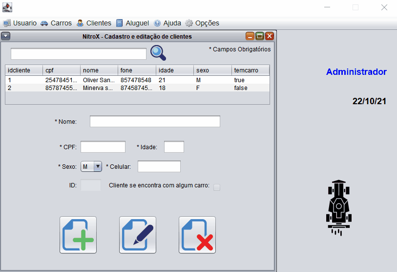

<h1 align="center">Restaurante Lechef</h1>

Esse é um projeto de finalização de curso, onde mostro minhas habilidades em programação WEB

 <a href="#caracteristicas">Características</a> •
 <a href="#pré-requisitos">Pré Requisitos</a> •
 <a href="#tecnologias">Tecnologias</a> •
 <a href="#autor">Autor</a>

---

 

### Características
<h1 align="center">
  <h1>Sistema de Login com Gerenciamento</h1>
  

  
  

  <h1>Sistema de Cadastro de Usuarios</h1>
  

  
  

  <h1>Sistema de Cadastro de Carros</h1>
  

  
  

  <h1>Sistema de Cadastro de Clientes com validação de CPF</h1>
  

  
  

  <h1>Sistema de Pedidos</h1>
  

  
  

</h1>
   

### Pré-requisitos

Antes de começar, você vai precisar ter instalado em sua máquina as seguintes ferramentas:
[Git](https://git-scm.com), [XAMPP](https://www.apachefriends.org/pt_br/index.html).

Você também vai precisar configurar o ambiente phpmyadmin.

Além disto é bom ter um editor para trabalhar com o código como [NetBeans](https://netbeans.apache.org/)

### Tecnologias

As seguintes ferramentas foram usadas na construção do projeto:

- [MySQL](https://www.mysql.com/)
- [JAVA](https://www.java.com/pt-BR/)

---

### Autor

